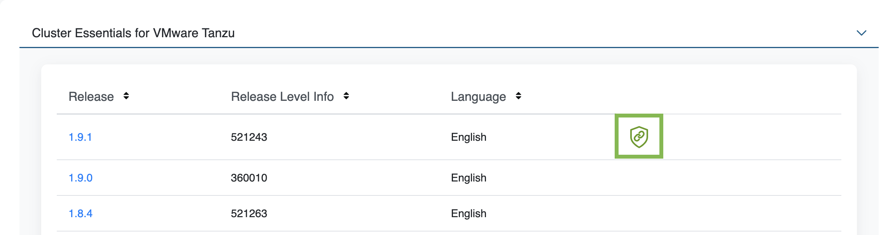

# Deploying Cluster Essentials v1.10

This topic tells you how to install, upgrade, and uninstall Cluster Essentials v1.10.

## <a id='supported-kube'></a> Supported Kubernetes versions

Installation requires Kubernetes cluster v1.26, v1.27, v1.28, v1.29 or 1.30  on one of the following Kubernetes
providers:

- Azure Kubernetes Service
- Amazon Elastic Kubernetes Service
- Google Kubernetes Engine
- Red Hat OpenShift v4.14 or v4.15 running on vSphere and baremetal clusters
- Minikube
- Kind

### <a id='supported-platforms'></a> Supported Platforms

The Cluster Essentials install script can only be run on AMD64 CPUs with macOS, Windows or Linux.

## <a id='install'></a> Install

If you are using a VMware Tanzu Kubernetes Grid cluster, you do not need to install Cluster Essentials because the contents of Cluster Essentials are already installed on your cluster.

For all other clusters, install Cluster Essentials using the following steps.

### <a id='download'></a> Download artifacts from the Broadcom Support Portal

1. Sign in to the [Broadcom Support Portal](https://support.broadcom.com).

1. Go to [Cluster Essentials for VMware Tanzu](https://support.broadcom.com/group/ecx/productdownloads?subfamily=Cluster+Essentials+for+VMware+Tanzu) in Tanzu > My Downloads.

1. Expand the **Cluster Essentials for VMWare Tanzu** section.

1. Retrieve your Broadcom registry API token:

    1. Click the Token Download icon next to the Cluster Essentials version you want to
       download.

        

    1. Follow the instructions in the dialog box. Save the token as a variable named
       `MY_BROADCOM_SUPPORT_ACCESS_TOKEN`. For example:

        ```console
        export MY_BROADCOM_SUPPORT_ACCESS_TOKEN=API-TOKEN
        ```

        Where `API-TOKEN` is your token from the Broadcom Support Portal.

1. Click **1.10.0**.

1. Select the **I agree to Terms and Conditions** check box.

1. Choose a download according to your Kubernetes provider and operating system:

    - For macOS, download `tanzu-cluster-essentials-darwin-amd64-1.10.0.tgz`.
    - For Linux, download `tanzu-cluster-essentials-linux-amd64-1.10.0.tgz`.
    - For Windows, download `tanzu-cluster-essentials-windows-amd64-1.10.0.tgz`.

1. Unpack the TAR file into the `tanzu-cluster-essentials` directory:

    - On macOS or Linux:

        ```console
        mkdir $HOME/tanzu-cluster-essentials
        tar -xvf DOWNLOADED-CLUSTER-ESSENTIALS-BUNDLE -C $HOME/tanzu-cluster-essentials
        ```

        Where `DOWNLOADED-CLUSTER-ESSENTIALS-BUNDLE` is the name of the bundle you downloaded.

    - On Windows, in Command Prompt:

        ```console
        :: Ensure you are in the directory where you have downloaded DOWNLOADED-CLUSTER-ESSENTIALS-BUNDLE
        mkdir tanzu-cluster-essentials
        tar -xvf DOWNLOADED-CLUSTER-ESSENTIALS-BUNDLE -C tanzu-cluster-essentials
        ```

        Where `DOWNLOADED-CLUSTER-ESSENTIALS-BUNDLE` is the name of the bundle you downloaded.

1. For air-gapped installation, download the bundle:

    - On macOS or Linux:

        ```console
        $ cd tanzu-cluster-essentials

        $ IMGPKG_REGISTRY_HOSTNAME=cluster-essentials.packages.broadcom.com \
          IMGPKG_REGISTRY_USERNAME=BROADCOM-REGISTRY-USERNAME \
          IMGPKG_REGISTRY_PASSWORD=${MY_BROADCOM_SUPPORT_ACCESS_TOKEN} \
          ./imgpkg copy \
            -b cluster-essentials.packages.broadcom.com/tanzu-cluster-essentials/cluster-essentials-bundle@sha256:7b62d4fb85c0c8807ed19fa14582e1f77791f492079fb50f54837bdb391fa8c2 \
            --to-tar cluster-essentials-bundle-1.10.0.tar \
            --include-non-distributable-layers
        ```

        <!-- Commands begins with $. Is there any reason for this? Should these commands begin with `export`? -->

        Where `BROADCOM-REGISTRY-USERNAME` is your username for Broadcom registry.

    - On Windows, in Command Prompt:

        ```console
        cd tanzu-cluster-essentials

        set IMGPKG_REGISTRY_HOSTNAME=cluster-essentials.packages.broadcom.com
        set IMGPKG_REGISTRY_USERNAME=BROADCOM-REGISTRY-USERNAME
        set /p IMGPKG_REGISTRY_PASSWORD=password:
        :: Interactively enter $MY_BROADCOM_SUPPORT_ACCESS_TOKEN
        imgpkg copy ^
          -b cluster-essentials.packages.broadcom.com/tanzu-cluster-essentials/cluster-essentials-bundle@sha256:7b62d4fb85c0c8807ed19fa14582e1f77791f492079fb50f54837bdb391fa8c2 ^
          --to-tar cluster-essentials-bundle-1.10.0.tar ^
          --include-non-distributable-layers
        ```

        Where `BROADCOM-REGISTRY-USERNAME` is your username for Broadcom registry.

### <a id='cluster-context'></a> Set Kubernetes cluster context

1. List the existing contexts by running:

    ```console
    kubectl config get-contexts
    ```

1. Set the context to the cluster that you want to use for the Cluster Essentials install.

    ```console
    kubectl config use-context CONTEXT-NAME
    ```

    Where `CONTEXT-NAME` can be retrieved from the outputs of the previous step.

### <a id='install'></a> Deploy onto the cluster

To deploy to your cluster, create a configuration secret if your registry requires a custom certificate
then run the script to install Cluster Essentials.

#### <a id='customer-cert'></a>(Optional) Set your custom certificate

If your registry needs a custom certificate, you must [load that configuration](https://carvel.dev/kapp-controller/docs/v0.41.0/controller-config/) into the cluster before installing `kapp-controller`.

If your registry uses a public certificate, these steps are not required.

1. Create the `kapp-controller` namespace:

    ```console
    kubectl create namespace kapp-controller
    ```

2. Create a configuration secret by using the registry's `ca.crt` stored on local disk:

    ```console
    kubectl create secret generic kapp-controller-config \
      --namespace kapp-controller \
      --from-file caCerts=ca.crt
    ```

#### <a id='install-unix'></a> Deploy using macOS or Linux

Configure and run `install.sh`, which installs `kapp-controller` and `secretgen-controller` on your cluster:

- For online installation, run:

    ```console
    export INSTALL_BUNDLE=cluster-essentials.packages.broadcom.com/tanzu-cluster-essentials/cluster-essentials-bundle@sha256:7b62d4fb85c0c8807ed19fa14582e1f77791f492079fb50f54837bdb391fa8c2
    export INSTALL_REGISTRY_HOSTNAME=cluster-essentials.packages.broadcom.com
    export INSTALL_REGISTRY_USERNAME=BROADCOM-REGISTRY-USERNAME
    export INSTALL_REGISTRY_PASSWORD=${MY_BROADCOM_SUPPORT_ACCESS_TOKEN}
    export CA_PATH=/PATH-TO-CA-CERT/ca.crt
    cd $HOME/tanzu-cluster-essentials
    ./install.sh --yes
    ```

    Where:

    - `BROADCOM-REGISTRY-USERNAME` is your username for Broadcom registry.
    - `PATH-TO-CA-CERT` is the location of your custom CA certificate.

        > **Note** `CA_PATH` is only required if your registry needs the custom certificate you optionally
        > provided earlier to pull the image and deploy kapp-controller.

- For air-gapped installation:

    Upload the previously downloaded bundle to the air-gapped registry and install Cluster Essentials by running:

    ```console
    $ cd tanzu-cluster-essentials

    $ IMGPKG_REGISTRY_HOSTNAME=MY-REGISTRY \
      IMGPKG_REGISTRY_USERNAME=MY-REGISTRY-USER \
      IMGPKG_REGISTRY_PASSWORD=MY-REGISTRY-PASSWORD \
      CA_PATH=/PATH-TO-CA-CERT/ca.crt \
      ./imgpkg copy \
        --tar cluster-essentials-bundle-1.10.0.tar \
        --to-repo MY-REGISTRY/cluster-essentials-bundle \
        --include-non-distributable-layers \
        --registry-ca-cert-path CA_PATH

    $ INSTALL_BUNDLE=MY-REGISTRY/cluster-essentials-bundle@sha256:7b62d4fb85c0c8807ed19fa14582e1f77791f492079fb50f54837bdb391fa8c2 \
      INSTALL_REGISTRY_HOSTNAME=MY-REGISTRY \
      INSTALL_REGISTRY_USERNAME=MY-REGISTRY-USER \
      INSTALL_REGISTRY_PASSWORD=MY-REGISTRY-PASSWORD \
      ./install.sh
    ```
    <!-- Commands begins with $. Is there any reason for this? Should these commands begin with `export`? -->

    Where:

    - `MY-REGISTRY` is your air-gapped container registry.
    - `MY-REGISTRY-USER` is the user with write access to `MY-REGISTRY`.
    - `MY-REGISTRY-PASSWORD` is the password for `MY-REGISTRY-USER`.
    - `PATH-TO-CA-CERT` is the location of your custom CA certificate.

        > **Note** `CA_PATH` is only required if your registry needs the custom certificate you optionally
        > provided earlier to pull the image and deploy kapp-controller.


#### <a id='install-windows'></a> Deploy using Windows

Configure and run `install.bat`, which installs `kapp-controller` and `secretgen-controller` on your cluster:

- For online installation, run:

    ```console
    cd tanzu-cluster-essentials

    set INSTALL_BUNDLE=cluster-essentials.packages.broadcom.com/tanzu-cluster-essentials/cluster-essentials-bundle@sha256:7b62d4fb85c0c8807ed19fa14582e1f77791f492079fb50f54837bdb391fa8c2
    set INSTALL_REGISTRY_HOSTNAME=cluster-essentials.packages.broadcom.com
    set INSTALL_REGISTRY_USERNAME=BROADCOM-REGISTRY-USERNAME
    set /p INSTALL_REGISTRY_PASSWORD=password:
    :: Interactively enter $MY_BROADCOM_SUPPORT_ACCESS_TOKEN
    set CA_PATH=/PATH-TO-CA-CERT/ca.crt
    install.bat
    ```

    Where:

    - `BROADCOM-REGISTRY-USERNAME` is your username for Broadcom registry.
    - `PATH-TO-CA-CERT` is the location of your custom CA certificate.

        > **Note** `CA_PATH` is only required if your registry needs the custom certificate you
        > provided earlier to pull the image and deploy kapp-controller.

- For air-gapped installation:

    Upload the previously downloaded bundle to the air-gapped registry and install Cluster Essentials by running:

    ```console
    cd tanzu-cluster-essentials

    set IMGPKG_REGISTRY_HOSTNAME=MY-REGISTRY
    set IMGPKG_REGISTRY_USERNAME=MY-REGISTRY-USER
    set IMGPKG_REGISTRY_PASSWORD=password:
    :: Interactive enter MY-REGISTRY-PASSWORD
    set CA_PATH=/PATH-TO-CA-CERT/ca.crt
    imgpkg copy ^
      --tar cluster-essentials-bundle-1.10.0.tar ^
      --to-repo MY-REGISTRY/cluster-essentials-bundle ^
      --include-non-distributable-layers ^
      --registry-ca-cert-path CA_PATH

    set INSTALL_BUNDLE=MY-REGISTRY/cluster-essentials-bundle@sha256:7b62d4fb85c0c8807ed19fa14582e1f77791f492079fb50f54837bdb391fa8c2
    set INSTALL_REGISTRY_HOSTNAME=MY-REGISTRY
    set INSTALL_REGISTRY_USERNAME=MY-REGISTRY-USER
    set /p INSTALL_REGISTRY_PASSWORD=password:
    :: Interactively enter MY-REGISTRY-PASSWORD
    install.bat
    ```

    Where:

    - `MY-REGISTRY` is your air-gapped container registry.
    - `MY-REGISTRY-USER` is the user with write access to `MY-REGISTRY`.
    - `MY-REGISTRY-PASSWORD` is the password for `MY-REGISTRY-USER`.
    - `PATH-TO-CA-CERT` is the location of your custom CA certificate.

        > **Note** `CA_PATH` is only required if your registry needs the custom certificate you
        > provided earlier to pull the image and deploy kapp-controller.

### <a id='cli-install'></a> (Optional) Install CLIs onto your `$PATH`

1. (Optional) Several Tanzu products, such as Tanzu Application Platform, use the `kapp` CLI to deploy. For convenience, you can install the `kapp` CLI onto your `$PATH`:

    ```console
    sudo cp $HOME/tanzu-cluster-essentials/kapp /usr/local/bin/kapp
    ```

1. (Optional) Several Tanzu products, such as Tanzu Application Platform, use the `imgpkg` CLI to relocate packages. For convenience, you can install the `imgpkg` CLI onto your `$PATH`:

    ```console
    sudo cp $HOME/tanzu-cluster-essentials/imgpkg /usr/local/bin/imgpkg
    ```

## <a id='upgrade'></a> Upgrade

Cluster Essentials components (such as `kapp-controller` and `secretgen-controller`) cannot be upgraded on clusters provisioned using VMware Tanzu Kubernetes Grid and VMware Tanzu Mission Control.

For all other clusters, if you already have Cluster Essentials v1.0 or later installed on your target
cluster, you can upgrade to Cluster Essentials v1.10 using the following steps.
Running this upgrade updates the `kapp-controller` version on your cluster to `v0.53.0` and `secretgen-controller` version to `v0.18.0`.

1. Follow the steps in [Download artifacts from the Broadcom Support Portal](#download) and
  [Set Kubernetes cluster context](#cluster-context).

1. Configure and run `install.sh`, which installs `kapp-controller` and `secretgen-controller` on your cluster:

    - On macOS or Linux:

        ```console
        cd $HOME/tanzu-cluster-essentials

        export INSTALL_BUNDLE=cluster-essentials.packages.broadcom.com/tanzu-cluster-essentials/cluster-essentials-bundle@sha256:7b62d4fb85c0c8807ed19fa14582e1f77791f492079fb50f54837bdb391fa8c2
        export INSTALL_REGISTRY_HOSTNAME=cluster-essentials.packages.broadcom.com
        export INSTALL_REGISTRY_USERNAME=BROADCOM-REGISTRY-USERNAME
        export INSTALL_REGISTRY_PASSWORD=${MY_BROADCOM_SUPPORT_ACCESS_TOKEN}

        ./install.sh --yes
        ```

        Where `BROADCOM-REGISTRY-USERNAME` is your username for Broadcom registry.

    - On Windows, in Command Prompt:

        ```console
        cd tanzu-cluster-essentials

        set INSTALL_BUNDLE=cluster-essentials.packages.broadcom.com/tanzu-cluster-essentials/cluster-essentials-bundle@sha256:7b62d4fb85c0c8807ed19fa14582e1f77791f492079fb50f54837bdb391fa8c2
        set INSTALL_REGISTRY_HOSTNAME=cluster-essentials.packages.broadcom.com
        set INSTALL_REGISTRY_USERNAME=BROADCOM-REGISTRY-USERNAME
        set /p INSTALL_REGISTRY_PASSWORD=password:
        :: Interactively enter $MY_BROADCOM_SUPPORT_ACCESS_TOKEN

        install.bat
        ```

        Where `BROADCOM-REGISTRY-USERNAME` is your username for Broadcom registry.

1. (Optional) Follow the steps in [Install CLIs onto your $PATH](#cli-install) to install newer
   versions of the `kapp` and `imgpkg` CLIs to your path.

### <a id='upgrade-rollback'></a> Rollback

>**Caution** Uninstalling Cluster Essentials when the upgrade fails will cause an unrepairable state for your cluster.

To rollback to the previously installed version, follow the previous version of Cluster Essentials deployment instructions.

## <a id='uninstall'></a> Uninstall

>**Caution** Uninstalling Cluster Essentials when the installation fails will cause an unrepairable state for your cluster.

>**Caution** You must uninstall all the Custom Resources created by `kapp-controller` and `secretgen-controller` before running the uninstall script for Cluster Essentials.

1. Follow the steps in [Set Kubernetes cluster context](#cluster-context).

1. Run `uninstall.sh`, which uninstalls `kapp-controller` and `secretgen-controller` on your cluster:

    On macOS or Linux:

    ```console
    cd $HOME/tanzu-cluster-essentials
    ./uninstall.sh --yes
    ```

    On Windows (in "Command Prompt" app):

    ```console
    cd tanzu-cluster-essentials
    uninstall.bat
    ```
